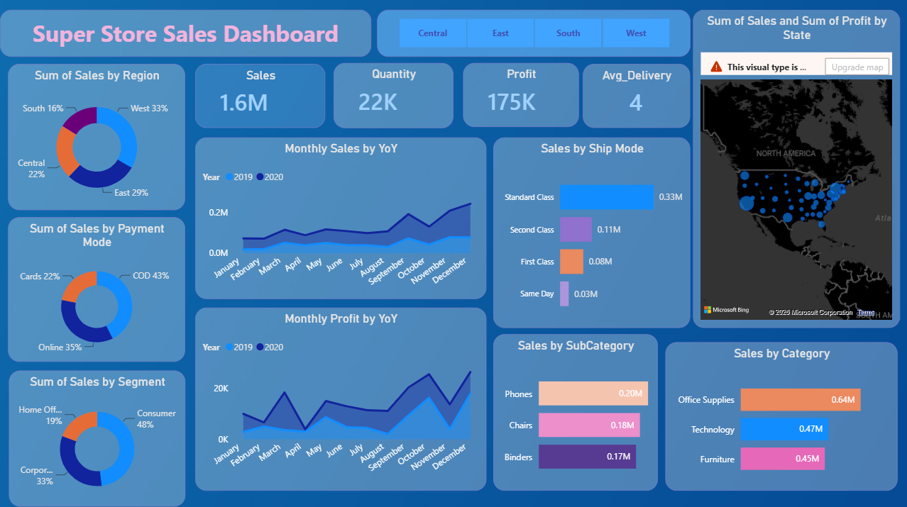
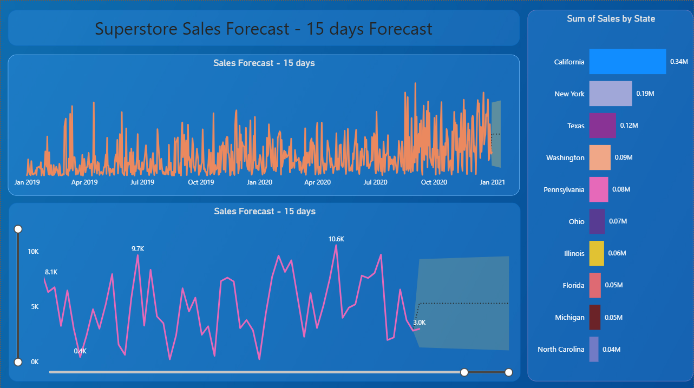

# 📊 Superstore Sales Forecast Dashboard

## 📌 Project Overview

This Power BI dashboard analyzes Superstore sales performance and predicts future sales trends using forecasting techniques.

---

## 🚀 Features

- Sales Overview
- Profit Analysis
- Regional Performance
- Category Analysis
- Monthly Sales Trend
- Sales Forecast
- Interactive Filters
- KPIs

---

## 🛠 Tools Used

- Power BI
- Power Query
- DAX
- Excel

---

## 📈 Dashboard

---

## 📉 Forecast

---

## Key Insights

- Highest Sales Region
- Best Performing Category
- Top Customers
- Monthly Profit Trends
- Future Sales Forecast

---

## Dataset

Superstore Sales Dataset

---

## Author

Vinay Bankapur
